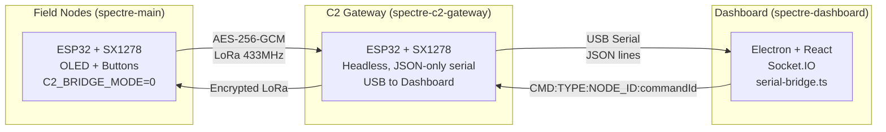
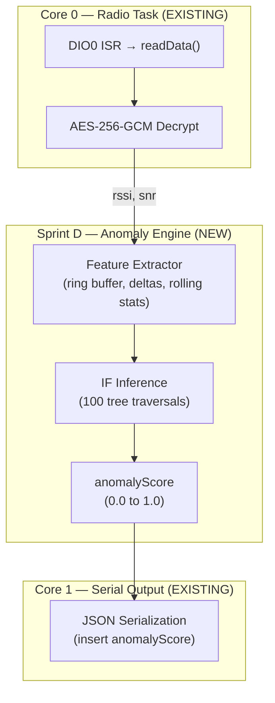

# Sprint D: Edge-AI Jamming Detection & Anti-Tamper — Feasibility & Implementation Plan

---

## 1. Current System Understanding

### 1.1 Architecture Overview



### 1.2 Data Flow (Relevant to Sprint D)

| Step | Location | What Happens |
|------|----------|--------------|
| 1 | `spectre-main` field node | Encrypts payload → builds `LoRaPacket` → LoRa TX |
| 2 | `spectre-c2-gateway` | DIO0 ISR fires → `radio.readData()` → decrypt → extract RSSI/SNR via `radio.getRSSI()` / `radio.getSNR()` |
| 3 | `spectre-c2-gateway` | Serializes to JSON: `{"nodeId":"...","rssi":-67,"snr":9.5,"anomalyScore":0.0,...}` |
| 4 | `serial-bridge.ts` | Parses JSON line → validates → emits `telemetry_matrix` via Socket.IO |
| 5 | `App.tsx` | Reducer ingests packet → if `anomalyScore > 0.7` → fires EW THREAT alert |
| 6 | `NodeTelemetryPanel.tsx` | `getJammingLevel()` renders HIGH/MEDIUM/LOW threat badge |
| 7 | `RadarMap.tsx` | Pulsing red ring if `anomalyScore > 0.7` |

> [!IMPORTANT]
> The **`anomalyScore` field already exists** in the JSON schema and is consumed by all three dashboard panels. It is currently hardcoded to `0.0` in the gateway firmware. Sprint D's primary job is to **compute a real value for this field**.

### 1.3 Modules That Must Remain Untouched

| Module | Reason |
|--------|--------|
| ECDH handshake (`0xAC` packets) | Cryptographic key exchange — zero tolerance for breakage |
| AES-256-GCM encrypt/decrypt | Core COMSEC — no modification |
| `LoRaPacket` / `LoRaKeyExchangePacket` structs | Wire-format compatibility between field nodes and gateway |
| Dashboard reducer, panels, Socket.IO | Already consume `anomalyScore`; no schema change needed |
| FreeRTOS radio task timing (`vTaskDelay(20)`) | 20ms tick is critical for not missing DIO0 interrupts |

### 1.4 Hardware Resources (ESP32-WROOM-32)

| Resource | Total | Used by Existing Firmware | Available |
|----------|-------|---------------------------|-----------|
| Flash | 4 MB | ~1.2 MB (firmware + libs) | ~2.8 MB |
| SRAM | 520 KB | ~180 KB (mbedTLS + FreeRTOS + RadioLib) | ~340 KB |
| CPU Cores | 2 (240 MHz each) | Core 0: Radio task / Core 1: Serial loop | Core 1 has spare cycles |
| GPIO (free) | Multiple | Used: SPI (5,14,26), I2C (21,22), Buttons (25,32,33) | GPIO 4, 13, 15, 27, 34, 35, 36, 39 available |

---

## 2. Sprint D Feasibility Analysis

### 2.1 The rf-jamming-detection Project

Your existing `rf-jamming-detection` Python pipeline is a **training and evaluation framework**, not a deployable inference engine. Here's the mapping:

| rf-jamming-detection Component | Sprint D Role | Deployable on ESP32? |
|-------------------------------|---------------|---------------------|
| `generator.py` — Synthetic telemetry | Training data source | ❌ Not needed on device |
| `attack_profiles.py` — Barrage/Spot/Pulse injection | Training augmentation | ❌ Not needed on device |
| `feature_engineering.py` — Rolling stats, EWMA, deltas | **Must port a subset** | ⚠️ Simplified version only |
| `preprocessing.py` — StandardScaler | **Must port** (mean/std normalization) | ✅ Trivial in C++ |
| `models.py` — IsolationForest (100 trees) | **Must port inference only** | ⚠️ See analysis below |
| `evaluation.py` — Metrics | Offline validation only | ❌ Not needed on device |
| `explainability.py` — SHAP | Offline analysis only | ❌ Not needed on device |
| `scaler.pkl` — Fitted StandardScaler params | **Export mean/std arrays** | ✅ Static const arrays |
| `isolation_forest.pkl` — Trained model (938 KB) | **Export tree structure** | ⚠️ See analysis below |

### 2.2 Isolation Forest on ESP32 — The Critical Question

The trained `isolation_forest.pkl` is **938 KB**. An Isolation Forest with 100 trees, each containing split nodes, is essentially a collection of binary decision trees.

**Inference algorithm (per sample):**
1. For each of 100 trees: traverse from root to leaf, counting path length
2. Average path length across all trees
3. Compute anomaly score: `score = 2^(-avg_path_length / c(n))`

**Memory estimate for the exported model:**
- Each tree node: `{feature_index (1B), threshold (4B float), left_child (2B), right_child (2B)}` = **9 bytes/node**
- Typical IF tree with `max_samples=256`: ~511 nodes max → **~4.5 KB/tree**
- 100 trees → **~450 KB** for the full model in flash (as `const` arrays)
- Runtime stack: traversal needs < 1 KB (iterative, no recursion)

| Resource | Requirement | Available | Verdict |
|----------|------------|-----------|---------|
| Flash for model | ~450 KB | ~2.8 MB | ✅ Fits easily |
| SRAM for inference | ~2 KB (feature buffer + path counters) | ~340 KB | ✅ Trivial |
| CPU for inference | ~0.1 ms per sample (100 tree traversals) | 5 MHz+ spare on Core 1 | ✅ Real-time capable |
| Feature buffer (rolling window) | ~2 KB (10-sample ring buffer × 5 features × 4B) | ~340 KB | ✅ Fits |

### 2.3 Feature Engineering on ESP32

The Python pipeline uses 3 rolling windows (10, 50, 100) × 5 features × 2 stats (mean, std) + deltas + EWMA = **~60+ features**.

**ESP32 constraint:** We need to minimize feature count to fit inference in real-time.

**Recommended reduced feature set (8 features):**

| # | Feature | Source | Computation |
|---|---------|--------|-------------|
| 1 | `rssi` | `radio.getRSSI()` | Direct |
| 2 | `snr` | `radio.getSNR()` | Direct |
| 3 | `noise_floor` | `rssi - snr` | Derived |
| 4 | `rssi_delta` | Current - Previous | 1-sample diff |
| 5 | `noise_floor_delta` | Current - Previous | 1-sample diff |
| 6 | `rssi_roll_mean_10` | Ring buffer | Running mean over 10 |
| 7 | `rssi_roll_std_10` | Ring buffer | Running std over 10 |
| 8 | `noise_floor_roll_std_10` | Ring buffer | Running std over 10 |

> [!NOTE]
> The model must be **retrained** in the Python pipeline using only these 8 features. The existing 60+ feature model cannot be used directly. This is a one-time offline step.

### 2.4 Anti-Tamper (Zeroization)

**Fully feasible.** The ESP32 has hardware interrupt capability on any GPIO.

| Mechanism | Implementation | Impact |
|-----------|---------------|--------|
| Panic button GPIO → NMI ISR | `attachInterrupt(PIN, zeroize, FALLING)` | Zero CPU/RAM impact until triggered |
| AES_KEY wipe | `memset(AES_KEY, 0, 32)` + overwrite with `esp_fill_random()` | Instantaneous |
| mbedTLS context wipe | `mbedtls_ecdh_free()` + `mbedtls_ctr_drbg_free()` | Instantaneous |
| Optional: SPIFFS/NVS wipe | `esp_partition_erase_range()` | ~100ms for flash erase |

---

## 3. Integration Architecture

### 3.1 Where Sprint D Sits



### 3.2 Data Flow (Post-Sprint D)

1. Radio task decrypts packet → extracts RSSI/SNR (existing)
2. **NEW:** Feeds RSSI, SNR, derived noise_floor into `AnomalyEngine`
3. **NEW:** `AnomalyEngine` updates ring buffer → computes 8 features → scales with embedded mean/std → traverses 100 IF trees → outputs `anomalyScore` (0.0–1.0)
4. `anomalyScore` replaces the hardcoded `0.0` in the JSON `Serial.printf()` (single line change)
5. Dashboard already renders the score with no changes needed

### 3.3 New Files/Modules

| File | Location | Purpose |
|------|----------|---------|
| `anomaly_engine.h` | `spectre-c2-gateway/src/` | Feature extraction + IF inference header |
| `anomaly_engine.cpp` | `spectre-c2-gateway/src/` | Implementation |
| `if_model_data.h` | `spectre-c2-gateway/src/` | Exported IF tree structures + scaler params (auto-generated) |
| `export_model.py` | `rf-jamming-detection/src/` | Python script to retrain with 8 features and export C arrays |
| `zeroize.h` | `spectre-c2-gateway/src/` | Anti-tamper ISR and key wipe |

### 3.4 Changes to Existing Files

| File | Change | Risk |
|------|--------|------|
| `spectre-c2-gateway/src/main.cpp` | Replace `\"anomalyScore\":0.0` with `\"anomalyScore\":%.4f` + call `anomalyEngine.score(rssi, snr)` | **Minimal** — single line in JSON printf |
| `spectre-c2-gateway/src/main.cpp` | Add `#include "anomaly_engine.h"` and `#include "zeroize.h"` | **Zero risk** — additive only |
| `spectre-c2-gateway/src/main.cpp` | Add `initZeroize(PIN)` in `setup()` | **Zero risk** — one line |
| `spectre-c2-gateway/platformio.ini` | No change needed (no new lib deps) | **None** |

> [!TIP]
> No changes to `spectre-main`, `spectre-dashboard`, `serial-bridge.ts`, or any dashboard component. The `anomalyScore` field is already in the JSON schema and fully consumed by the UI.

---

## 4. Implementation Plan

### Phase 1: Model Retraining & Export (Offline, Python)

**Files:** `rf-jamming-detection/src/export_model.py`

1. Retrain Isolation Forest using only the 8 reduced features
2. Evaluate to confirm accuracy doesn't degrade below 90%
3. Export tree structures as C header arrays:
   - `const float scaler_mean[8] = {...};`
   - `const float scaler_std[8] = {...};`
   - `const IFNode if_trees[100][MAX_NODES] = {...};`
4. Validate exported model produces identical scores to Python inference

### Phase 2: Anomaly Engine (C++, Gateway Firmware)

**Files:** `anomaly_engine.h`, `anomaly_engine.cpp`, `if_model_data.h`

1. Implement `RingBuffer<float, 10>` for rolling statistics
2. Implement `FeatureExtractor::update(float rssi, float snr)` → returns 8-feature vector
3. Implement `StandardScaler::transform(float features[8])` using embedded mean/std
4. Implement `IsolationForest::score(float scaled_features[8])` → returns 0.0–1.0
5. Wrap in `AnomalyEngine` class with single `float computeScore(float rssi, float snr)` API

### Phase 3: Gateway Integration (Minimal diff)

**Files:** `spectre-c2-gateway/src/main.cpp` (3–5 lines changed)

1. Add `#include "anomaly_engine.h"`
2. Instantiate `AnomalyEngine engine;` as global
3. In RX handler after decrypt: `float aScore = engine.computeScore(radio.getRSSI(), radio.getSNR());`
4. Replace `\"anomalyScore\":0.0` → `\"anomalyScore\":%.4f, aScore`

### Phase 4: Anti-Tamper Zeroization

**Files:** `zeroize.h`, `main.cpp` (2 lines)

1. Define `PANIC_PIN` (recommend GPIO 4 — free, has interrupt capability)
2. Write ISR: wipe `AES_KEY[32]`, free mbedTLS contexts, optional flash erase
3. Add `initZeroize(PANIC_PIN)` at end of `setup()`

### Phase 5: Validation

1. **Unit test (PC):** Run exported C model against Python model on test dataset → scores must match within ε=0.001
2. **Integration test (ESP32):** Flash gateway → feed known-jamming RSSI/SNR values via serial loopback → verify `anomalyScore > 0.7` in JSON output
3. **End-to-end test (Hardware):** Field node TX → gateway RX → dashboard shows threat badge
4. **Zeroization test:** Press panic button → verify AES_KEY is zeroed → subsequent decryption fails

---

## 5. Risk Analysis

### 5.1 Functional Risks

| Risk | Severity | Mitigation |
|------|----------|------------|
| Anomaly engine delays radio task | HIGH | Run inference in Core 1 (main loop) not Core 0, or measure inference time (expected <1ms) |
| Model accuracy drops with 8 features vs 60+ | MEDIUM | Retrain and validate offline; noise_floor and its std are the strongest predictors |
| Ring buffer not filled on cold start → bad scores | LOW | Return `anomalyScore = 0.0` until buffer has ≥10 samples |
| False positives trigger unnecessary EW alerts | MEDIUM | Dashboard already has tiered thresholds (0.4/0.7/0.85); operator makes final call |
| Zeroization ISR corrupts in-flight packet | LOW | ISR runs on different core; radio task checks `keyExchangeComplete` flag before decrypt |

### 5.2 Resource Risks

| Risk | Severity | Mitigation |
|------|----------|------------|
| Model too large for flash | VERY LOW | 450 KB << 2.8 MB available. Can also reduce to 50 trees if needed |
| Stack overflow from inference | VERY LOW | Iterative tree traversal, no recursion. ~100 bytes stack max |
| Inference latency causes missed packets | VERY LOW | IF inference is O(100 × log₂(256)) = ~800 comparisons = <0.1ms |

### 5.3 False Positive/Negative Analysis

From the existing `report_if.md`:
- **Precision:** 0.8188 (18% false positive rate — acceptable for alerting, operator confirms)
- **Recall:** 0.8365 (16% false negative rate — some attacks may be missed)
- **ROC AUC:** 0.9809 (excellent separation capability)

> [!WARNING]
> The 18% false positive rate is from the full 60+ feature model. With only 8 features, expect **slight degradation**. Mitigation: the dashboard presents anomaly scores as a gradient (LOW/MEDIUM/HIGH), not a binary alarm. The operator always has the final decision.

---

## 6. Final Recommendation

### Verdict: ✅ FULLY FEASIBLE

Sprint D is fully feasible with the current hardware and software architecture. The integration is **surgically clean** — only 3–5 lines change in existing code, and the `anomalyScore` field is already wired end-to-end through the entire dashboard.

### Recommended Architecture

| Component | Approach |
|-----------|----------|
| **Anomaly Detection** | Isolation Forest inference ported to C++ as static const tree arrays |
| **Feature Engineering** | 8-feature reduced set with 10-sample ring buffer |
| **Model Training** | Offline in Python (`rf-jamming-detection`), export as C header |
| **Anti-Tamper** | GPIO interrupt → NMI ISR → AES key + context zeroization |
| **Integration Point** | `spectre-c2-gateway/src/main.cpp` — 3 lines modified |
| **Dashboard Changes** | **None** — anomalyScore is already consumed |

### Priority Classification

| Priority | Component | Rationale |
|----------|-----------|-----------|
| **Must-Have** | Anomaly engine (IF inference) | Core Sprint D deliverable |
| **Must-Have** | Zeroization ISR | Anti-tamper is non-negotiable for defense pitch |
| **Should-Have** | Model retraining with 8 features | Required for accuracy, but can use heuristic fallback |
| **Should-Have** | EWMA smoothing on anomaly scores | Reduces score jitter between packets |
| **Optional** | Threat classification (Barrage/Spot/Pulse) | SHAP is too heavy for ESP32; can be done dashboard-side |
| **Optional** | NVS flash erase on zeroize | Adds ~100ms to ISR; only needed if DTN store-forward is implemented |

### Implementation Order (Safest)

```
Phase 1 (Python, offline) → Phase 2 (new C++ files, no existing code touched)
→ Phase 3 (3 lines in main.cpp) → Phase 4 (2 lines in main.cpp) → Phase 5 (validation)
```

> [!IMPORTANT]
> Phases 1–2 create **entirely new files** with zero risk to existing functionality. Phase 3 is a single `printf` format string change. Phase 4 is a single `setup()` line addition. The architecture is designed for maximum safety.
